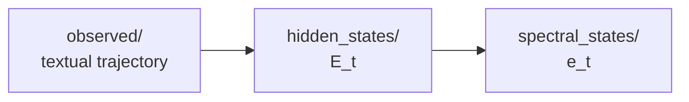

# 디렉토리 구조 및 데이터 스키마

CoT 추론을 latent state space planning 문제로 재구성하기 위한 데이터 파이프라인.
텍스트 궤적(`observed/`)에서 hidden state를 추출하고, spectral embedding으로 고정 크기 상태 벡터를 얻는다.

## 개요



| 층 | 표현 | 크기 |
|---|---|---|
| observed | 자연어 텍스트 | 가변 |
| hidden state | $E_t \in \mathbb{R}^{n_t \times d}$ | 스텝마다 다름 |
| latent state | $e_t \in \mathbb{R}^{kd}$ | 고정 (k=8, d=2048 → 16384) |

## 전체 트리

```
ROOT/
├── observed/                          # 사람이 읽는 층 (textual)
│   ├── source/                        # [계획] BabyAI 원본 궤적
│   │   └── {case}/{level}/{step}/*.jsonl
│   ├── source_cot_prompting/          # [계획] CoT 프롬프트 적용 상태
│   │   └── {case}/{level}/{step}/*.jsonl
│   └── reasoning_trajectory/          # 현재 파이프라인 입력
│       ├── success/{case}/{level}/{step}/*.jsonl
│       └── failure/{case}/{level}/{step}/*.jsonl
│
└── latent/                            # 벡터 층
    ├── hidden_states/
    │   └── {case}/{level}/{step}/
    │       ├── meta.jsonl
    │       ├── full_sequence/{id}.pt
    │       └── cumulative_prefix/{id}.pt
    └── spectral_states/
        └── {case}/{level}/{step}/{method}/{tag}/{id}.pt
```

`{tag}` = `k{K}` + `_scaled`(옵션) + `_signfix`(옵션)
→ `k8_scaled_signfix`, `k8_scaled`, `k8_signfix`, `k8`

## 스키마

### observed — jsonl (한 줄 = 한 에피소드)

```json
{
  "id": "gotoseq_0042",
  "level": "GoToSeq",
  "mission": "go to the red ball",
  "steps": ["You see a wall 2 steps forward", "..."],
  "terminal": "...",
  "answer": {
    "success": true,
    "action_seq": ["turn left", "go forward"]
  }
}
```

### hidden_states — `{id}.pt`

| 키 | 타입 | 설명 |
|---|---|---|
| `E` | `dict[int, Tensor]` | `{t: (n_t, 2048)}`, bfloat16 |
| `method` | `str` | `full_sequence` \| `cumulative_prefix` |
| `model` | `str` | `Qwen/Qwen2.5-3B-Instruct` |

### hidden_states — `meta.jsonl`

| 필드 | 설명 |
|---|---|
| `id` | `.pt` 파일명과 대응되는 조인 키 |
| `level` | 레벨 라벨 |
| `success` | 성공 여부 |
| `action_seq` | 액션 라벨 (ARI confound 검증용) |
| `n_steps` | `len(action_seq) + 2` (mission, terminal 포함) |
| `src` | 출처 jsonl 파일명 |

### spectral_states — `{id}.pt`

| 키 | 타입 | 설명 |
|---|---|---|
| `e` | `dict[int, Tensor]` | `{t: (kd,)}` — **최종 latent state** |
| `eigvals` | `dict[int, Tensor]` | `{t: (k,)}` — decay curve용 |
| `V` | `dict[int, Tensor]` | `{t: (k, d)}` — `e`에서 복원 가능 |
| `k`, `scale`, `fix_sign` | | 설정 재현용 |
| `src`, `model` | `str` | 프로비넌스 |

## 인덱스 규약

`build_babyai`가 `[mission] + steps + [terminal]`로 합치므로:

| 인덱스 | 내용 | `action_seq` 대응 |
|---|---|---|
| `0` | mission | — |
| `1 .. T-2` | 실제 스텝 | `action_seq[t-1]` |
| `T-1` | terminal | — |

분석 시 mission/terminal 제외:

```python
Es = torch.stack([e[t] for t in sorted(e)][1:-1])  # (T-2, 16384)
# Es[i] ↔ action_seq[i]
```

## 실행

```bash
# 기본: full_sequence 추출 + k=8, scale=T, signfix=T
python main.py --case c3 --level gotoseq --step step10

# 두 method 모두
python main.py --case c3 --level gotoseq --step step10 \
    --methods full_sequence cumulative_prefix

# 추출 생략, spectral 설정 스윕
python main.py --case c3 --level gotoseq --step step10 \
    --no-extract --scale true false --fix-sign true false

# k 여러 값
python main.py --case c3 --level gotoseq --step step10 --no-extract -k 4 8 16
```

## 산출량

에피소드 $N$개, method $M$개, spectral 설정 $S = |k| \times |\text{scale}| \times |\text{fix\_sign}|$개일 때:

| 위치 | 파일 수 |
|---|---|
| `hidden_states/*/{method}/` | $N \times M$ |
| `spectral_states/*/{method}/{tag}/` | $N \times M \times S$ |

용량 (에피소드당 30스텝, $n_t \approx 20$ 기준):

| | 에피소드당 | 100 에피 |
|---|---|---|
| `E` (bf16) | 2.4 MB | 240 MB |
| `e` (fp32) | 1.9 MB | 190 MB |
| `V` (fp32) | 1.9 MB | 190 MB |

## 알려진 제약

- **재실행**: `extract_run`은 id 충돌 시 `FileExistsError`로 중단. 재추출하려면 출력 디렉토리를 먼저 삭제.
- **success/failure 분리**: 현재 latent 층에 split 계층이 없어 두 궤적이 같은 경로로 섞인다. `--split` 인자 추가 필요.
- **meta.jsonl 덮어쓰기**: `--methods`를 여럿 주면 마지막 method가 meta를 다시 쓴다. 내용은 동일하나 중간 실패 시 손실 가능.
- **fp32 검증**: 현재 bfloat16으로 추출하므로 full-sequence ↔ prefix 등가성 검증(`rel_fro < 1e-6`)은 불가. 검증용은 fp32/eager로 별도 실행 필요.
- **짧은 스텝**: $n_t < k$인 경우 $e_t$ 뒷부분이 0으로 채워진다. 해당 스텝 비율 확인 권장.

## 미구현

- `source` → `source_cot_prompting` → `reasoning_trajectory` 변환 스크립트
- BALROG 덤프 스키마(`messages`, `completion`, `action`) → observed 스키마 변환
- 128차원 projection (현재 $e_t$는 16,384차원)